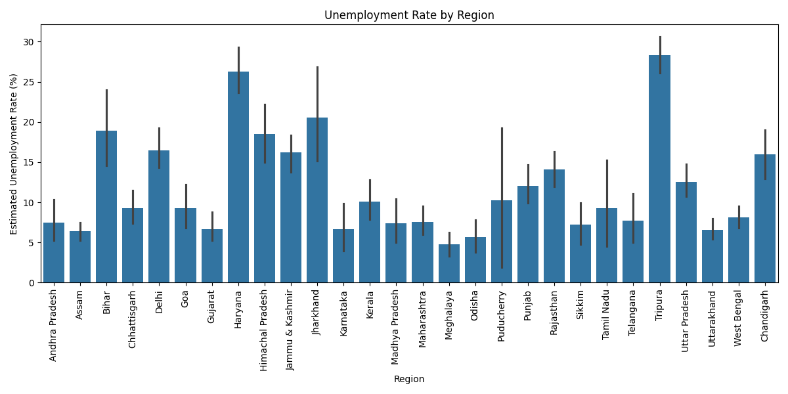
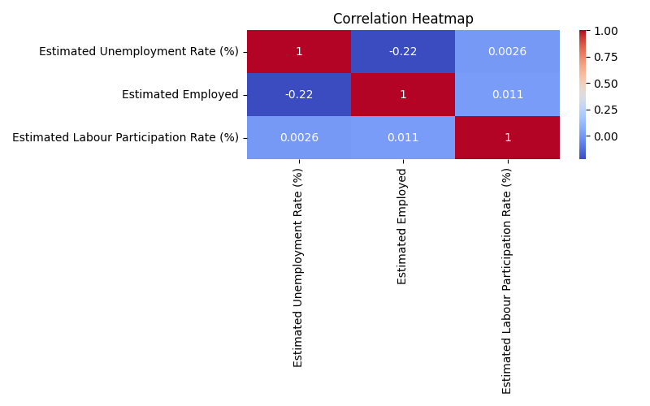
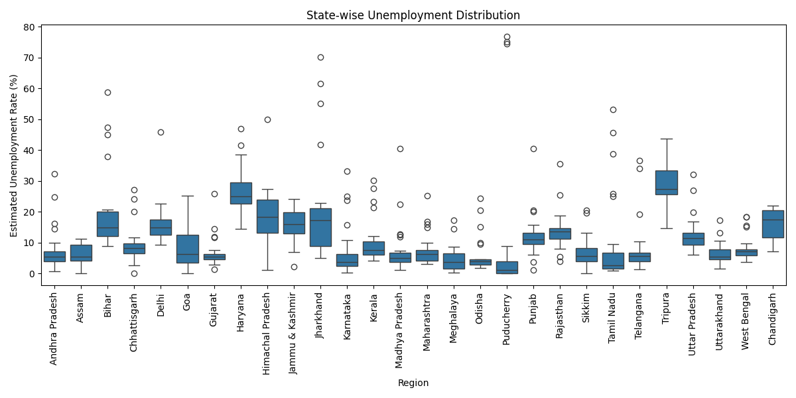

# Unemployment Analysis with Python

## Project Overview

This project analyzes unemployment trends in India using Python. The analysis focuses on unemployment rates across different regions and investigates patterns that emerged during the Covid-19 period.

## Objectives

* Clean and preprocess unemployment data
* Analyze unemployment trends
* Visualize unemployment rates across regions
* Study the impact of Covid-19
* Identify important economic patterns

## Technologies Used

* Python
* Pandas
* NumPy
* Matplotlib
* Seaborn

## Visualizations

### Regional Unemployment Analysis

### Correlation Heatmap

### State-wise Distribution

## Conclusion

The analysis highlights variations in unemployment across regions and provides insights into economic disruptions during the Covid-19 period.

## Author

Purna Chandra Rao Nilagiri
